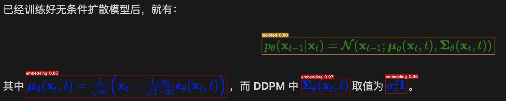
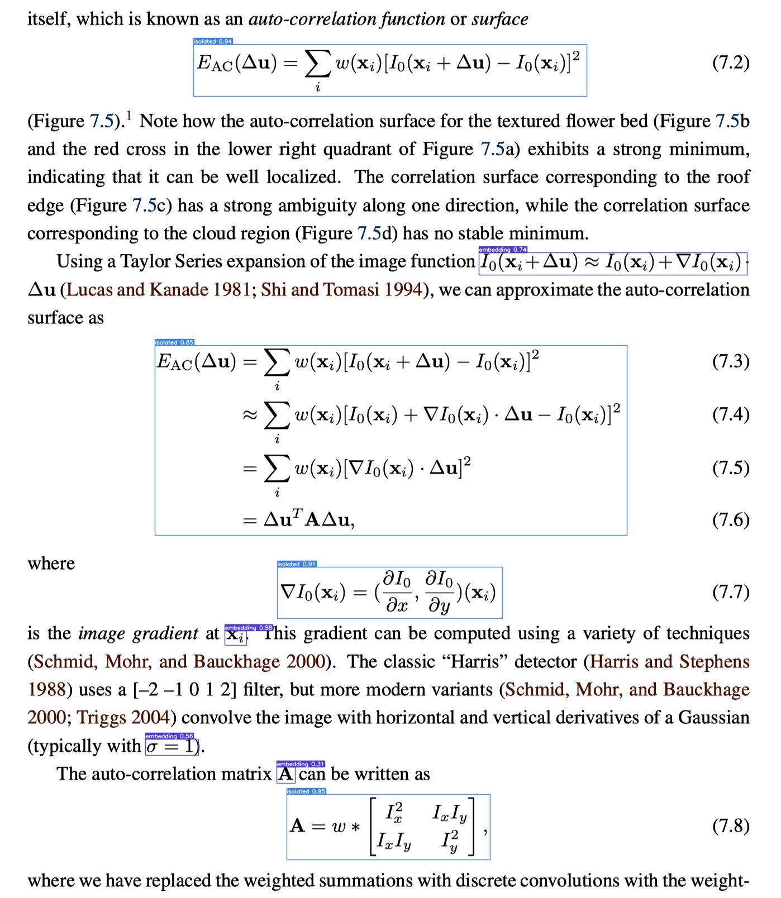
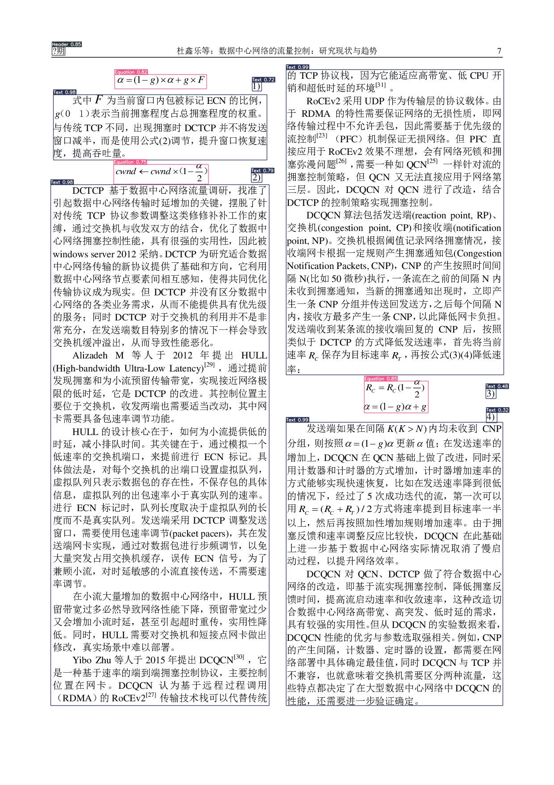

<div align="center">
	
  <div>&nbsp;</div>

[](https://pepy.tech/project/cnstd)
[](https://visitorbadge.io/status?path=https%3A%2F%2Fgithub.com%2Fbreezedeus%2FCnSTD)
[](./LICENSE)
[](https://badge.fury.io/py/cnstd)
[](https://img.shields.io/github/forks/breezedeus/cnstd)
[](https://github.com/breezedeus/cnocr)


[](https://twitter.com/breezedeus)

</div>

<div align="center">

[English](./README_en.md) | 中文

</div>


# CnSTD
# Update 2024.06.16：发布 V1.2.4

主要变更：

* 支持基于 Ultralytics 的 YOLO Detector。


# Update 2023.06.30：发布 V1.2.3

主要变更：

* 基于新标注的数据，重新训练了 **MFD YoloV7** 模型，目前新模型已部署到 [P2T网页版](https://p2t.behye.com) 。具体说明见：[Pix2Text (P2T) 新版公式检测模型 | Breezedeus.com](https://www.breezedeus.com/article/p2t-mfd-20230613) 。
* 之前的 MFD YoloV7 模型已开放给星球会员下载，具体说明见：[P2T YoloV7 数学公式检测模型开放给星球会员下载 | Breezedeus.com](https://www.breezedeus.com/article/p2t-yolov7-for-zsxq-20230619) 。
* 增加了一些Label Studio相关的脚本，见 [scripts](scripts) 。如：利用 CnSTD 自带的 MFD 模型对目录中的图片进行公式检测后生成可导入到Label Studio中的JSON文件；以及，Label Studio标注后把导出的JSON文件转换成训练 MFD 模型所需的数据格式。注意，MFD 模型的训练代码在 [yolov7](https://github.com/breezedeus/yolov7) （`dev` branch）中。

了解更多：[RELEASE.md](./RELEASE.md) 。

---


**CnSTD** 是 **Python 3** 下的**场景文字检测**（**Scene Text Detection**，简称**STD**）工具包，支持**中文**、**英文**等语言的文字检测，自带了多个训练好的检测模型，安装后即可直接使用。**CnSTD** 自 **V1.2.1** 版本开始，加入了**数学公式检测**（**Mathematical Formula Detection**，简称**MFD**）模型，并提供训练好的模型可直接用于检测图片中包含的数学公式（**行内公式** `embedding` 与**独立行公式** `isolated` ）。

欢迎扫码加入微信交流群：

<div align="center">
  
</div>

作者也维护 **知识星球** [**CnOCR/CnSTD/P2T私享群**](https://t.zsxq.com/FEYZRJQ)，欢迎加入。**知识星球私享群**会陆续发布一些CnOCR/CnSTD/P2T相关的私有资料，包括**更详细的训练教程**，**未公开的模型**，使用过程中遇到的难题解答等。本群也会发布OCR/STD相关的最新研究资料。

自 **V1.0.0** 版本开始，**CnSTD** 从之前基于 MXNet 实现转为基于 **PyTorch** 实现。新模型的训练合并了  **ICPR MTWI 2018**、**ICDAR RCTW-17** 和 **ICDAR2019-LSVT** 三个数据集，包括了 **`46447`** 个训练样本，和 **`1534`** 个测试样本。

相较于之前版本， 新版本的变化主要包括：

* 加入了对 [**PaddleOCR**](https://github.com/PaddlePaddle/PaddleOCR) 检测模型的支持；
* 部分调整了检测结果中 `box` 的表达方式，统一为 `4` 个点的坐标值；  
* 修复了已知bugs。

如需要识别文本框中的文字，可以结合 **OCR** 工具包 **[cnocr](https://github.com/breezedeus/cnocr)** 一起使用。


## 示例

### 场景文字检测（STD）

<div align="center">
  
</div>

### 数学公式检测（MFD）

MFD 模型检测图片中包含的数学公式，其中行内的公式检测为 `embedding` 类别，独立行的公式检测为 `isolated`。模型训练使用了英文 [IBEM](https://zenodo.org/record/4757865) 和中文 [CnMFD_Dataset](https://github.com/breezedeus/CnMFD_Dataset) 两个数据集。

<div align="center">
  
</div>  
<div align="center">
  
</div>
<div align="center">
  
</div> 


### 版面分析（Layout Analysis）

版面分析模型识别图片中的不同排版元素。模型训练使用的是 [CDLA](https://github.com/buptlihang/CDLA) 数据集。可识别以下10中版面元素：

|正文|标题|图片|图片标题|表格|表格标题|页眉|页脚|注释|公式|
|---|---|---|---|---|---|---|---|---|---|
|Text|Title|Figure|Figure caption|Table|Table caption|Header|Footer|Reference|Equation|

<div align="center">
  
</div>  


## 安装

嗯，顺利的话很简单（bless）。

```bash
pip install cnstd
```

如果需要使用 ONNX 模型（`model_backend=onnx`），请使用以下命令安装：

* CPU环境使用 ONNX 模型：
  ```bash
  pip install cnstd[ort-cpu]
  ```
* GPU环境使用 ONNX 模型：
  ```bash
  pip install cnstd[ort-gpu]
  ```
  * 注意：如果当前环境已经安装了 `onnxruntime` 包，请先手动卸载（`pip uninstall onnxruntime`）后再运行上面的命令。

安装速度慢的话，可以指定国内的安装源，如使用豆瓣源：

```bash
pip install cnstd -i https://mirrors.aliyun.com/pypi/simple
```

【注意】：

* 请使用 **Python3** (3.6以及之后版本应该都行)，没测过Python2下是否ok。
* 依赖 **opencv**，所以可能需要额外安装opencv。

## 已有STD模型

CnSTD 从 **V1.2** 开始，可直接使用的模型包含两类：1）CnSTD 自己训练的模型，通常会包含 PyTorch 和 ONNX 版本；2）从其他ocr引擎搬运过来的训练好的外部模型，ONNX化后用于 CnSTD 中。

直接使用的模型都放在 [**cnstd-cnocr-models**](https://huggingface.co/breezedeus/cnstd-cnocr-models) 项目中，可免费下载使用。

### 1. CnSTD 自己训练的模型

当前版本（Since **V1.1.0**）的文字检测模型使用的是 [**DBNet**](https://github.com/MhLiao/DB)，相较于 V0.1 使用的 [PSENet](https://github.com/whai362/PSENet) 模型， DBNet 的检测耗时几乎下降了一个量级，同时检测精度也得到了极大的提升。

目前包含以下已训练好的模型：

| 模型名称                       | 参数规模      | 模型文件大小    | 测试集精度（IoU） | 平均推断耗时<br />（秒/张） | 下载方式                                                      |
| -------------------------- | --------- | --------- | ---------- | ----------------- | --------------------------------------------------------- |
| db_resnet34                | 22.5 M    | 86 M      | **0.7322** | 3.11              | 自动                                                        |
| db_resnet18                | 12.3 M    | 47 M      | 0.7294     | 1.93              | 自动                                                        |
| db_mobilenet_v3            | 4.2 M     | 16 M      | **0.7269** | 1.76              | 自动                                                        |
| db_mobilenet_v3_small      | 2.0 M     | 7.9 M     | 0.7054     | 1.24              | 自动                                                        |
| db_shufflenet_v2           | 4.7 M     | 18 M      | 0.7238     | 1.73              | 自动                                                        |
| **db_shufflenet_v2_small** | 3.0 M     | 12 M      | 0.7190     | 1.29              | 自动                                                        |
| db_shufflenet_v2_tiny      | **1.9 M** | **7.5 M** | **0.7172** | **1.14**          | [下载链接](https://mp.weixin.qq.com/s/fHPNoGyo72EFApVhEgR6Nw) |

> 上表耗时基于本地 Mac 获得，绝对值无太大参考价值，相对值可供参考。IoU的计算方式经过调整，仅相对值可供参考。

相对于两个基于 **ResNet** 的模型，基于 **MobileNet** 和 **ShuffleNet** 的模型体积更小，速度更快，建议在轻量级场景使用。

### 2. 外部模型

以下模型是 [**PaddleOCR**](https://github.com/PaddlePaddle/PaddleOCR) 中模型的 **ONNX** 版本，所以不会依赖 **PaddlePaddle** 相关工具包，故而也不支持基于这些模型在自己的领域数据上继续精调模型。这些模型支持检测**竖排文字**。

| `model_name`    | PyTorch 版本 | ONNX 版本 | 支持检测的语言    | 模型文件大小 |
| --------------- | ---------- | ------- | ---------- | ------ |
| ch_PP-OCRv3_det | X          | √       | 简体中问、英文、数字 | 2.3 M  |
| ch_PP-OCRv2_det | X          | √       | 简体中问、英文、数字 | 2.2 M  |
| en_PP-OCRv3_det | X          | √       | **英文**、数字  | 2.3 M  |

更多模型可参考 [PaddleOCR/models_list.md](https://github.com/PaddlePaddle/PaddleOCR/blob/release%2F2.5/doc/doc_ch/models_list.md) 。如有其他外语（如日、韩等）检测需求，可在 **知识星球** [**CnOCR/CnSTD私享群**](https://t.zsxq.com/FEYZRJQ) 中向作者提出建议。

## 使用方法

首次使用 **CnSTD** 时，系统会自动下载zip格式的模型压缩文件，并存放于 `~/.cnstd`目录（Windows下默认路径为 `C:\Users\<username>\AppData\Roaming\cnstd`）。下载速度超快。下载后的zip文件代码会自动对其解压，然后把解压后的模型相关目录放于`~/.cnstd/1.2`目录中。

如果系统无法自动成功下载zip文件，则需要手动从 [百度云盘](https://pan.baidu.com/s/1zDMzArCDrrXHWL0AWxwYQQ?pwd=nstd)（提取码为 `nstd`）下载对应的zip文件并把它存放于 `~/.cnstd/1.2`（Windows下为 `C:\Users\<username>\AppData\Roaming\cnstd\1.2`）目录中。模型也可从 **[cnstd-cnocr-models](https://huggingface.co/breezedeus/cnstd-cnocr-models)** 中下载。放置好zip文件后，后面的事代码就会自动执行了。

### 场景文字检测（STD）

使用类 `CnStd` 进行场景文字的检测。类 `CnStd` 的初始化函数如下：

```python
class CnStd(object):
    """
    场景文字检测器（Scene Text Detection）。虽然名字中有个"Cn"（Chinese），但其实也可以轻松识别英文的。
    """

    def __init__(
        self,
        model_name: str = 'ch_PP-OCRv3_det',
        *,
        auto_rotate_whole_image: bool = False,
        rotated_bbox: bool = True,
        context: str = 'cpu',
        model_fp: Optional[str] = None,
        model_backend: str = 'onnx',  # ['pytorch', 'onnx']
        root: Union[str, Path] = data_dir(),
        use_angle_clf: bool = False,
        angle_clf_configs: Optional[dict] = None,
        **kwargs,
    ):
```

其中的几个参数含义如下：

* `model_name`:  模型名称，即前面模型表格第一列中的值。默认为 **ch_PP-OCRv3_det** 。

* `auto_rotate_whole_image`:  是否自动对整张图片进行旋转调整。默认为`False`。

* `rotated_bbox`:  是否支持检测带角度的文本框；默认为 `True`，表示支持；取值为 `False` 时，只检测水平或垂直的文本。

* `context`：预测使用的机器资源，可取值为字符串`cpu`、`gpu`、`cuda:0`。

* `model_fp`:  如果不使用系统自带的模型，可以通过此参数直接指定所使用的模型文件（`.ckpt`文件）。

* `model_backend` (str): 'pytorch', or 'onnx'。表明预测时是使用 PyTorch 版本模型，还是使用 ONNX 版本模型。  同样的模型，ONNX 版本的预测速度一般是 PyTorch 版本的2倍左右。默认为 `onnx`。

* `root`: 模型文件所在的根目录。
  
  * Linux/Mac下默认值为 `~/.cnstd`，表示模型文件所处文件夹类似 `~/.cnstd/1.2/db_shufflenet_v2_small`。
  * Windows下默认值为 `C:\Users\<username>\AppData\Roaming\cnstd`。

* `use_angle_clf` (bool): 对于检测出的文本框，是否使用角度分类模型进行调整（检测出的文本框可能会存在倒转180度的情况）。默认为 `False`

* `angle_clf_configs` (dict): 角度分类模型对应的参数取值，主要包含以下值：
  
  - `model_name`: 模型名称。默认为 'ch_ppocr_mobile_v2.0_cls'
  - `model_fp`: 如果不使用系统自带的模型，可以通过此参数直接指定所使用的模型文件（'.onnx' 文件）。默认为 `None`。具体可参考类 `AngleClassifier` 的说明

每个参数都有默认取值，所以可以不传入任何参数值进行初始化：`std = CnStd()`。

文本检测使用类`CnOcr`的函数 **`detect()`**，以下是详细说明：

#### 类函数`CnStd.detect()`

```python
    def detect(
        self,
        img_list: Union[
            str,
            Path,
            Image.Image,
            np.ndarray,
            List[Union[str, Path, Image.Image, np.ndarray]],
        ],
        resized_shape: Union[int, Tuple[int, int]] = (768, 768),
        preserve_aspect_ratio: bool = True,
        min_box_size: int = 8,
        box_score_thresh: float = 0.3,
        batch_size: int = 20,
        **kwargs,
    ) -> Union[Dict[str, Any], List[Dict[str, Any]]]:
```

**函数说明**：

函数输入参数包括：

- `img_list`: 支持对单个图片或者多个图片（列表）的检测。每个值可以是图片路径，或者已经读取进来 `PIL.Image.Image` 或 `np.ndarray`,  格式应该是 `RGB` 3 通道，shape: `(height, width, 3)`, 取值范围：`[0, 255]`。

- `resized_shape`: `int` or `tuple`, `tuple` 含义为 `(height, width)`, `int` 则表示高宽都为此值；  
   检测前，先把原始图片resize到接近此大小（只是接近，未必相等）。默认为 `(768, 768)`。
  
  > **Note** **（注意）**
  > 这个取值对检测结果的影响较大，可以针对自己的应用多尝试几组值，再选出最优值。例如 `(512, 768)`, `(768, 768)`, `(768, 1024)`等。

- `preserve_aspect_ratio`: 对原始图片 resize 时是否保持高宽比不变。默认为 `True`。

- `min_box_size`: 过滤掉高度或者宽度小于此值的文本框。默认为 `8`，也即高或者宽小于 `8` 的文本框会被过滤去掉。

- `box_score_thresh`: 过滤掉得分低于此值的文本框。默认为 `0.3`。

- `batch_size`: 待处理图片很多时，需要分批处理，每批图片的数量由此参数指定。默认为 `20`。

- `kwargs`: 保留参数，目前未被使用。

函数输出类型为`list`，其中每个元素是一个字典，对应一张图片的检测结果。字典中包含以下 `keys`：

- `rotated_angle`: `float`, 整张图片旋转的角度。只有 `auto_rotate_whole_image==True` 才可能非 `0`。

- `detected_texts`: `list`, 每个元素存储了检测出的一个框的信息，使用词典记录，包括以下几个值：
  
  - `box`：检测出的文字对应的矩形框；`np.ndarray`, shape: `(4, 2)`，对应 box 4个点的坐标值 `(x, y)`;
  
  - `score`：得分；`float` 类型；分数越高表示越可靠；
  
  - `cropped_img`：对应 "box" 中的图片patch（`RGB`格式），会把倾斜的图片旋转为水平。`np.ndarray`类型，`shape: (height, width, 3)`,  取值范围：`[0, 255]`；
  
  - 示例:
    
    ```python
      [{'box': array([[416,  77],
                      [486,  13],
                      [800, 325],
                      [730, 390]], dtype=int32),
        'score': 1.0, 
        'cropped_img': array([[[25, 20, 24],
                               [26, 21, 25],
                               [25, 20, 24],
                              ...,
                               [11, 11, 13],
                               [11, 11, 13],
                               [11, 11, 13]]], dtype=uint8)},
       ...
      ]
    ```

#### 调用示例

```python
from cnstd import CnStd
std = CnStd()
box_info_list = std.detect('examples/taobao.jpg')
```

或：

```python
from PIL import Image
from cnstd import CnStd

std = CnStd()
img_fp = 'examples/taobao.jpg'
img = Image.open(img_fp)
box_infos = std.detect(img)
```

### 识别检测框中的文字（OCR）

上面示例识别结果中"cropped_img"对应的值可以直接交由 **[cnocr](https://github.com/breezedeus/cnocr)** 中的 **`CnOcr`** 进行文字识别。如上例可以结合  **`CnOcr`** 进行文字识别：

```python
from cnstd import CnStd
from cnocr import CnOcr

std = CnStd()
cn_ocr = CnOcr()

box_infos = std.detect('examples/taobao.jpg')

for box_info in box_infos['detected_texts']:
    cropped_img = box_info['cropped_img']
    ocr_res = cn_ocr.ocr_for_single_line(cropped_img)
    print('ocr result: %s' % str(ocr_res))
```

注：运行上面示例需要先安装  **[cnocr](https://github.com/breezedeus/cnocr)** ：

```bash
pip install cnocr
```


### 数学公式检测（MFD）与 版面分析（Layout Analysis）

数学公式检测（MFD）与 版面分析（Layout Analysis）都是检测图片中感兴趣的元素，它们使用的都是基于YOLOv7的检测架构，在CnSTD都来源于相同的类 `LayoutAnalyzer`，差别只是训练模型使用的数据不同。

> 这两个模型的训练代码在 [yolov7](https://github.com/breezedeus/yolov7) 中（Forked from [WongKinYiu/yolov7](https://github.com/WongKinYiu/yolov7)，感谢原作者。）


类 `LayoutAnalyzer` 的初始化函数如下：

```python
class LayoutAnalyzer(object):
    def __init__(
        self,
        model_name: str = 'mfd',  # 'layout' or 'mfd'
        *,
        model_type: str = 'yolov7_tiny',  # 当前支持 [`yolov7_tiny`, `yolov7`]'
        model_backend: str = 'pytorch',
        model_categories: Optional[List[str]] = None,
        model_fp: Optional[str] = None,
        model_arch_yaml: Optional[str] = None,
        root: Union[str, Path] = data_dir(),
        device: str = 'cpu',
        **kwargs,
    )
```

其中的参数含义如下：

- `model_name`: 字符串类型，表示模型类型。可选值：'mfd' 表示数学公式检测；'layout' 表示版面分析。默认值：'mfd'

- `model_type`: 字符串类型，表示模型类型。当前支持 'yolov7_tiny' 和 'yolov7'；默认值：'yolov7_tiny'。'yolov7' 模型暂不开源，当前仅开放给星球会员下载，具体说明见：[P2T YoloV7 数学公式检测模型开放给星球会员下载 | Breezedeus.com](https://www.breezedeus.com/article/p2t-yolov7-for-zsxq-20230619) 。

- `model_backend`: 字符串类型，表示backend。当前仅支持: 'pytorch'；默认值：'pytorch'

- `model_categories`: 模型的检测类别名称。默认值：None，表示基于 `model_name` 自动决定

- `model_fp`: 字符串类型，表示模型文件的路径。默认值：`None`，表示使用默认的文件路径

- `model_arch_yaml`: 架构文件路径，例如 'yolov7-mfd.yaml'；默认值为 None，表示将自动选择。

- `root`: 字符串或`Path`类型，表示模型文件所在的根目录。
  - Linux/Mac下默认值为 `~/.cnstd`，表示模型文件所处文件夹类似 `~/.cnstd/1.2/analysis`
  - Windows下默认值为 `C:/Users/<username>/AppData/Roaming/cnstd`。
  
- `device`: 字符串类型，表示运行模型的设备，可选值：'cpu' 或 'gpu'；默认值：'cpu'

- `**kwargs`: 额外的参数。


#### 类函数`LayoutAnalyzer.analyze()`

对指定图片（列表）进行版面分析。

```python
def analyze(
    self,
    img_list: Union[
        str,
        Path,
        Image.Image,
        np.ndarray,
        List[Union[str, Path, Image.Image, np.ndarray]],
    ],
    resized_shape: Union[int, Tuple[int, int]] = 700,
    box_margin: int = 2,
    conf_threshold: float = 0.25,
    iou_threshold: float = 0.45,
) -> Union[List[Dict[str, Any]], List[List[Dict[str, Any]]]]:
```


**函数说明**：

函数输入参数包括：

* `img_list` (str or list): 待识别图片或图片列表；如果是 `np.ndarray`，则应该是shape为 `[H, W, 3]` 的 RGB 格式数组
* `resized_shape` (int or tuple): (H, W); 把图片resize到此大小再做分析；默认值为 `700`
* `box_margin` (int): 对识别出的内容框往外扩展的像素大小；默认值为 `2`
* `conf_threshold` (float): 分数阈值；默认值为 `0.25`
* `iou_threshold` (float): IOU阈值；默认值为 `0.45`
* `**kwargs`: 额外的参数。

函数输出结果为一个`list`（如果 `img_list` 为 `list`，返回为两层嵌套的 `list`，其中每个元素为对应图片的检测结果），其中每个元素表示识别出的版面中的一个元素，包含以下信息：

* type: 版面元素对应的类型；可选值来自：`self.categories` ;
* box: 版面元素对应的矩形框；`np.ndarray`, shape: (4, 2)，对应 box 4个点的坐标值 `(x, y)` ;
* score: 得分，越高表示越可信 。


#### 调用示例

```python
from cnstd import LayoutAnalyzer
img_fp = 'examples/mfd/zh5.jpg'
analyzer = LayoutAnalyzer('mfd')
out = analyzer.analyze(img_fp, resized_shape=700)
print(out)
```


### 脚本使用

**cnstd** 包含了几个命令行工具，安装 **cnstd** 后即可使用。

#### STD 预测单个文件或文件夹中所有图片

使用命令 **`cnstd predict`** 预测单个文件或文件夹中所有图片，以下是使用说明：

```bash
(venv) ➜  cnstd git:(master) ✗ cnstd predict -h
Usage: cnstd predict [OPTIONS]

  预测单个文件，或者指定目录下的所有图片

Options:
  -m, --model-name [ch_PP-OCRv2_det|ch_PP-OCRv3_det|db_mobilenet_v3|db_mobilenet_v3_small|db_resnet18|db_resnet34|db_shufflenet_v2|db_shufflenet_v2_small|db_shufflenet_v2_tiny|en_PP-OCRv3_det]
                                  模型名称。默认值为 db_shufflenet_v2_small
  -b, --model-backend [pytorch|onnx]
                                  模型类型。默认值为 `onnx`
  -p, --pretrained-model-fp TEXT  使用训练好的模型。默认为 `None`，表示使用系统自带的预训练模型
  -r, --rotated-bbox              是否检测带角度（非水平和垂直）的文本框。默认为 `True`
  --resized-shape TEXT            格式："height,width";
                                  预测时把图片resize到此大小再进行预测。两个值都需要是32的倍数。默认为
                                  `768,768`

  --box-score-thresh FLOAT        检测结果只保留分数大于此值的文本框。默认值为 `0.3`
  --preserve-aspect-ratio BOOLEAN
                                  resize时是否保留图片原始比例。默认值为 `True`
  --context TEXT                  使用cpu还是 `gpu` 运行代码，也可指定为特定gpu，如`cuda:0`。默认为
                                  `cpu`

  -i, --img-file-or-dir TEXT      输入图片的文件路径或者指定的文件夹
  -o, --output-dir TEXT           检测结果存放的文件夹。默认为 `./predictions`
  -h, --help                      Show this message and exit.
```

例如可以使用以下命令对图片 `examples/taobao.jpg`进行检测，并把检测结果存放在目录 `outputs`中：

```bash
cnstd predict -i examples/taobao.jpg -o outputs
```

具体使用也可参考文件 [Makefile](./Makefile) 。


#### MFD or Layout Analysis 预测单个文件

使用命令 **`cnstd analyze`** 获得单个文件的 MFD 或者 Layout Analysis 结果，以下是使用说明：

```bash
(venv) ➜  cnstd git:(master) ✗ cnstd analyze -h
Usage: cnstd analyze [OPTIONS]

  对给定图片进行 MFD 或者 版面分析。

Options:
  -m, --model-name TEXT           模型类型。`mfd` 表示数学公式检测，`layout`
                                  表示版面分析；默认为：`mfd`
  -t, --model-type TEXT           模型类型。当前支持 [`yolov7_tiny`, `yolov7`]
  -b, --model-backend [pytorch|onnx]
                                  模型后端架构。当前仅支持 `pytorch`
  -c, --model-categories TEXT     模型的检测类别名称（","分割）。默认值：None，表示基于 `model_name`
                                  自动决定
  -p, --model-fp TEXT             使用训练好的模型。默认为 `None`，表示使用系统自带的预训练模型
  -y, --model-arch-yaml TEXT      模型的配置文件路径
  --device TEXT                   cuda device, i.e. 0 or 0,1,2,3 or cpu
  -i, --img-fp TEXT               待分析的图片路径或图片目录
  -o, --output-fp TEXT            分析结果输出的图片路径。默认为 `None`，会存储在当前文件夹，文件名称为输入文件名称
                                  前面增加`out-`；如输入文件名为 `img.jpg`, 输出文件名即为 `out-
                                  img.jpg`；如果输入为目录，则此路径也应该是一个目录，会将输出文件存储在此目录下
  --resized-shape INTEGER         分析时把图片resize到此大小再进行。默认为 `608`
  --conf-thresh FLOAT             Confidence Threshold。默认值为 `0.25`
  --iou-thresh FLOAT              IOU threshold for NMS。默认值为 `0.45`
  -h, --help                      Show this message and exit.
```

例如可以使用以下命令对图片 `examples/mfd/zh.jpg` 进行 MFD，并把检测结果存放在文件 `out-zh.jpg` 中：

```bash
(venv) ➜  cnstd analyze -m mfd --conf-thresh 0.25 --resized-shape 800 -i examples/mfd/zh.jpg -o out-zh.jpg
```

具体使用也可参考文件 [Makefile](./Makefile) 。

#### 模型训练

使用命令 **`cnstd train`**  训练文本检测模型，以下是使用说明：

```bash
(venv) ➜  cnstd git:(master) ✗ cnstd train -h
Usage: cnstd train [OPTIONS]

  训练文本检测模型

Options:
  -m, --model-name [db_resnet50|db_resnet34|db_resnet18|db_mobilenet_v3|db_mobilenet_v3_small|db_shufflenet_v2|db_shufflenet_v2_small|db_shufflenet_v2_tiny]
                                  模型名称。默认值为 `db_shufflenet_v2_small`
  -i, --index-dir TEXT            索引文件所在的文件夹，会读取文件夹中的 `train.tsv` 和 `dev.tsv` 文件
                                  [required]

  --train-config-fp TEXT          训练使用的json配置文件  [required]
  -r, --resume-from-checkpoint TEXT
                                  恢复此前中断的训练状态，继续训练
  -p, --pretrained-model-fp TEXT  导入的训练好的模型，作为初始模型。优先级低于 "--restore-training-
                                  fp"，当传入"--restore-training-fp"时，此传入失效

  -h, --help                      Show this message and exit.
```

具体使用可参考文件 [Makefile](./Makefile) 。

#### 模型转存

训练好的模型会存储训练状态，使用命令 **`cnstd resave`**  去掉与预测无关的数据，降低模型大小。

```bash
(venv) ➜  cnstd git:(master) ✗ cnstd resave -h
Usage: cnstd resave [OPTIONS]

  训练好的模型会存储训练状态，使用此命令去掉预测时无关的数据，降低模型大小

Options:
  -i, --input-model-fp TEXT   输入的模型文件路径  [required]
  -o, --output-model-fp TEXT  输出的模型文件路径  [required]
  -h, --help                  Show this message and exit.
```

## 未来工作

* [x] 进一步精简模型结构，降低模型大小
* [x] PSENet速度上还是比较慢，尝试更快的STD算法
* [x] 加入更多的训练数据
* [x] 加入对外部模型的支持
* [x] 加入数学公式检测（MFD）与 版面分析（Layout Analysis）模型
* [ ] 加入对文档结构与表格的检测


## 给作者来杯咖啡

开源不易，如果此项目对您有帮助，可以考虑 [给作者来杯咖啡 ☕️](https://cnocr.readthedocs.io/zh/latest/buymeacoffee/) 。

---

官方代码库：[https://github.com/breezedeus/cnstd](https://github.com/breezedeus/cnstd)。